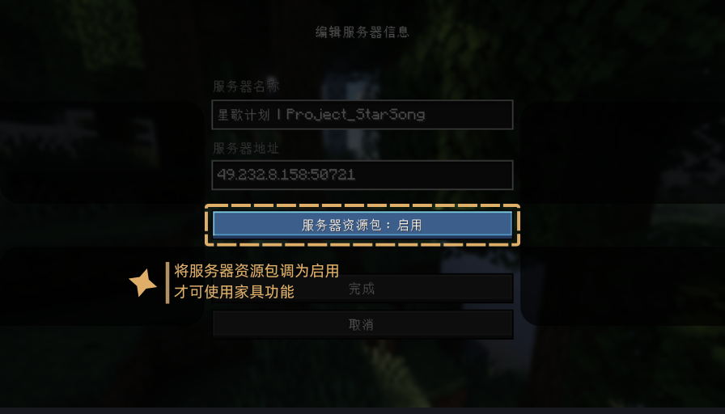

# 加入服务器

> 在这里你可以了解到如何加入服务器～

## 加入条件

1.客户端要求：Minecraft Java 正版，无需额外 Mod。版本推荐 1.21.8 

2.必读文档：加入服务器即代表您阅读并同意[玩家守则](/docs/rules)

3.社交渠道：建议加入[玩家群组(829272674)](https://qm.qq.com/cgi-bin/qm/qr?k=P0s88fHw8A8UhIf4zu0qL6vkkf4oxlQU&jump_from=webapi&authKey=dPjZ/dM6O1LvaMKgWGZ3TCyZL6w7hr7BjeeFgg8wyVYtmuABFUqnqm4InpIU8a4J)，如果您仅想了解服务器动态，可以加入[事务群](https://qm.qq.com/cgi-bin/qm/qr?k=FbkC7uOPkP8NLhfDLWg3UfXBpL2LaH2m&jump_from=webapi&authKey=sSplywRN8h9CDgahYd9PEdPs7Mw8BHhGqRhUkvCy5CJyA7TH//xGRXbTvJH1Mlq5)

4.启用服务器资源包：可选，推荐启用

5.最后，通过地址``mc.starsong.top``进入服务器
